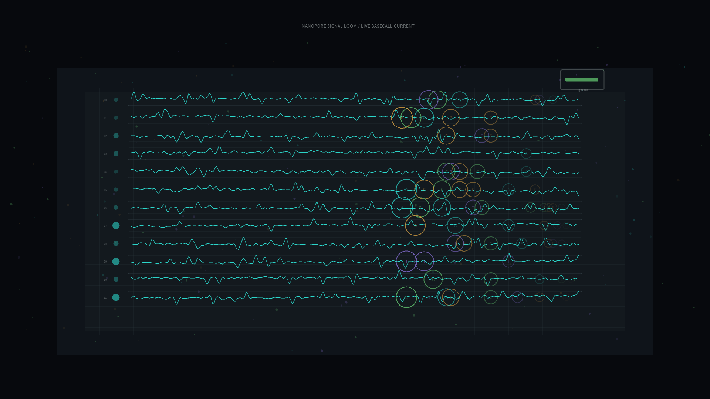

# nanopore_signal_loom

## Metadata
- **Date**: 2026-05-19
- **Theme**: A sequencing flow cell listening to strands of DNA as tiny current interruptions become readable signals.
- **Technique**: Procedural nanopore sensor channels with stochastic base events, ion-current traces, pore glow pulses, molecule drift, base-call rings, and quality meter.
- **Logic Lab Reference**: None

## Concept
`nanopore_signal_loom` treats live DNA sequencing as a quiet instrument panel. Parallel pores emit cyan current traces, base calls appear as colored pulses, and drifting molecular specks suggest strands passing through a membrane while the system converts interruption into information.

## Technical Details
- **Renderer**: P2D
- **Simulation**: Multi-channel stochastic current traces with base-specific blockage amplitudes, live base-call events, quality relaxation, and drifting molecule particles
- **Visuals**: Graphite flow-cell panel, cyan current traces, A/C/G/T base colors, green quality meter, silver sensor grid
- **Animation**: 10 seconds at 60fps, generating `output.mp4` and `nanopore_signal_loom_p1.png`
