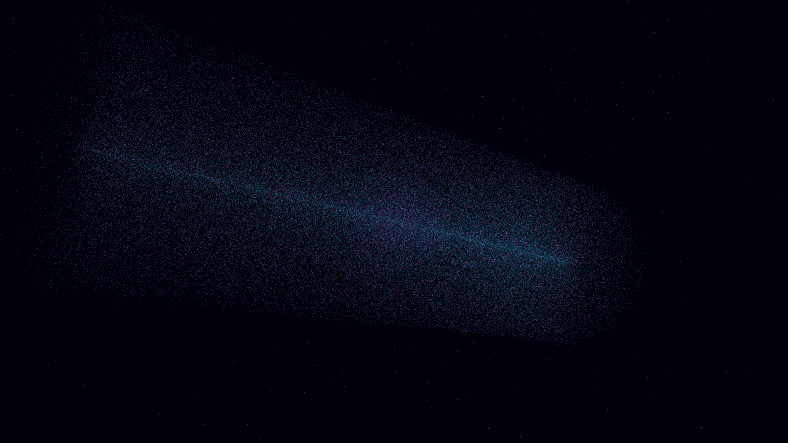

# nebular_filament_lattice

## Metadata
- **Date**: 2026-05-06
- **Theme**: Interstellar filaments, magnetic alignment, silken textures, beautiful night sky.
- **Technique**: 3D simulation of a complex intergalactic filament network using 200,000 particles. Particles follow a braided magnetic vector field generated via vectorized rotation matrices and helical drift. Features multi-pass additive rendering with a spectral Teal and Amethyst palette, a central volumetric energy pulse, and a high-density background starfield. 60fps high-bitrate MP4.
- **Logic Lab Reference**: None

## Concept
A majestic, shimmering web of luminous filaments that stretch across the cosmic void; thousands of silken threads in electric teal and soft amethyst pulse with energy, appearing like cosmic silk woven by invisible magnetic forces against the silent obsidian night.

## Technical Details
- **Renderer**: P3D
- **Simulation**: particle.
- **Visuals**: additive blending, HSB spectral mapping, bloom-like highlights, prismatic color, dark-field contrast.
- **Animation**: 10 seconds at 60fps
