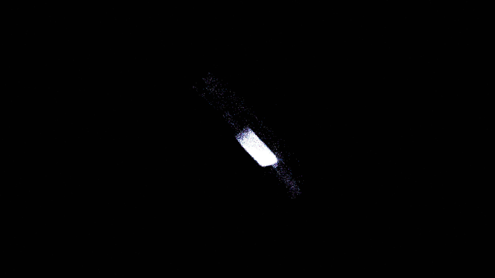

# nematic_liquid_crystal_disclinations

## Metadata
- **Date**: 2026-05-11
- **Theme**: Liquid crystals, topological defects, disclination lines, soft matter physics, beautiful night sky.
- **Technique**: 3D tensor field simulation (simplified director field) where orientation is influenced by moving defect centers (vortices). Features 40,000 tracers advected along the director field. Rendered with manual 3D-to-2D projection, multi-pass additive blending, and a "Spectral Blue / Pearl / Ionized Amethyst" palette. 15s 4K/60fps MP4.
- **Logic Lab Reference**: None

## Concept
Silken filaments of pearl and blue light weave through the obsidian void, revealing the tangled topological defects of a liquid crystal phase as it relaxes toward equilibrium.

## Technical Details
- **Renderer**: P2D
- **Simulation**: 3D tensor field simulation (simplified director field) where orientation is influenced by moving defect centers (vortices).
- **Visuals**: additive blending, HSB spectral mapping, prismatic color, dark-field contrast.
- **Animation**: 15 seconds at 60fps
