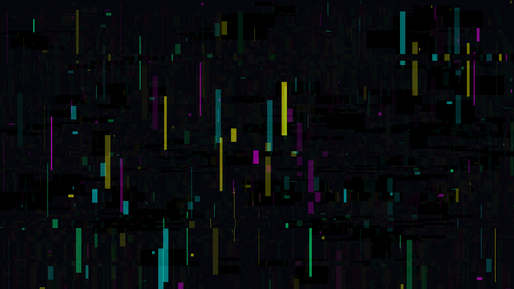

# neon_cellular_datamosh

## Metadata
- **Date**: 2026-05-23
- **Theme**: The relentless, infectious spread of corrupted data through a structured system, represented by neon cellular automata bleeding into chaotic horizontal datamosh lines.
- **Technique**: Procedurally generated cellular rectangles drawn with high saturation RGB colors (Cyan, Magenta, Yellow, Green) on a dark background. NumPy is used for real-time pixel manipulation, introducing horizontal screen tearing and RGB channel swapping to simulate datamoshing and signal corruption. 15s 60fps MP4.
- **Logic Lab Reference**: None

## Concept
A visualization of a structured digital system being overwhelmed by vibrant, chaotic data corruption. Clean geometric shapes are continuously ripped apart and color-shifted, leaving neon trails that bleed across the canvas in unpredictable patterns.

## Technical Details
- **Renderer**: P2D / default py5
- **Simulation**: Random cellular generation and continuous NumPy buffer manipulation
- **Visuals**: Additive blending, horizontal tearing, RGB channel swapping, glitch aesthetic
- **Animation**: 15 seconds at 60fps
