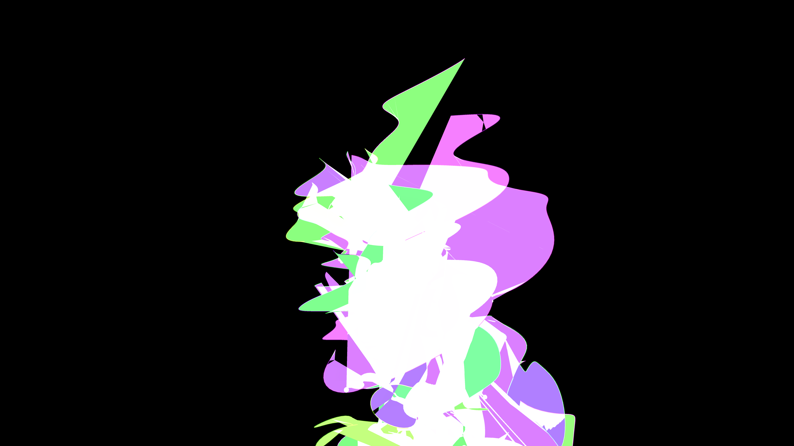

# neon_cyber_botanical_vines_3d

## Metadata
- **Date**: 2026-06-07
- **Theme**: An intricate, mechanical 3D vine structure that grows and weaves itself around a central vertical co
- **Technique**: Unknown
- **Logic Lab Reference**: 

## Concept
An intricate, mechanical 3D vine structure that grows and weaves itself around a central vertical column, simulating a cyber-botanical organism hacking its environment.

## Technical Details
- **Renderer**: Unknown
- **Simulation**: Unknown
- **Visuals**: Unknown
- **Animation**: Contains animation details
