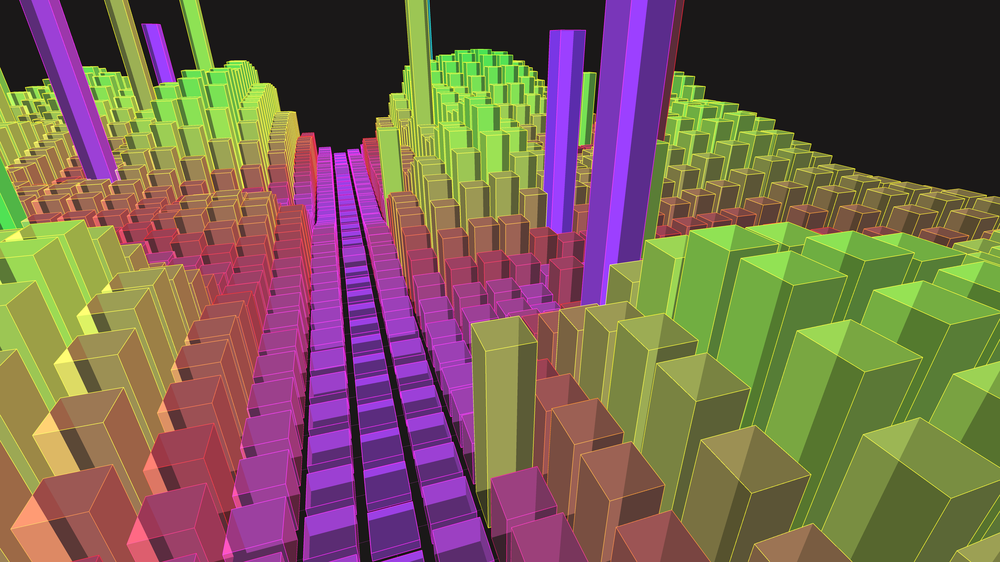

# neon_cyberpunk_infinity_city_3d

## Metadata
- **Date**: 2026-06-07
- **Theme**: A cinematic flyover of an infinite, glowing futuristic city
- **Technique**: * Procedural grid generation with `py5.box()` mapped to a rolling 2D `py5.os_noise()` height map. * Modulo coordinate system to create the illusion of an infinite scrolling grid. * Additive blending with deep color hues mapped by building heights. * Directional and ambient lighting to simulate neon-lit cyberpunk streets.
- **Logic Lab Reference**: 

## Concept
A cinematic flyover of an infinite, glowing futuristic city. The camera glides steadily forward over a shifting, procedural skyscraper range composed entirely of neon wireframes and translucent data-surfaces.

## Technical Details
- **Renderer**: Unknown
- **Simulation**: Unknown
- **Visuals**: Unknown
- **Animation**: Contains animation details
