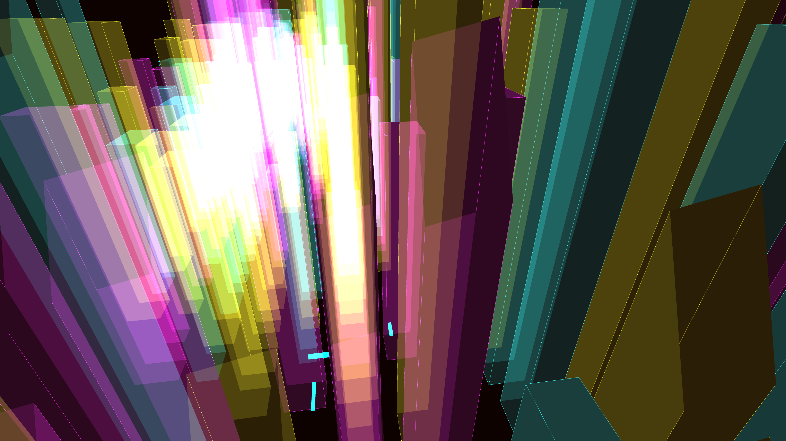

# neon_cyberpunk_megacity_grid_3d

## Details
- **Date**: 2026-06-07
- **Theme**: A sprawling, procedurally generated futuristic megacity glowing with neon data streams.
- **Technique**: Procedural 3D box generation representing buildings with additive blending, moving particles representing traffic, and a camera flying through the city grid.
- **Palette**: Obsidian background, cyan, magenta, and yellow (CMY) neon accents.

## Media

