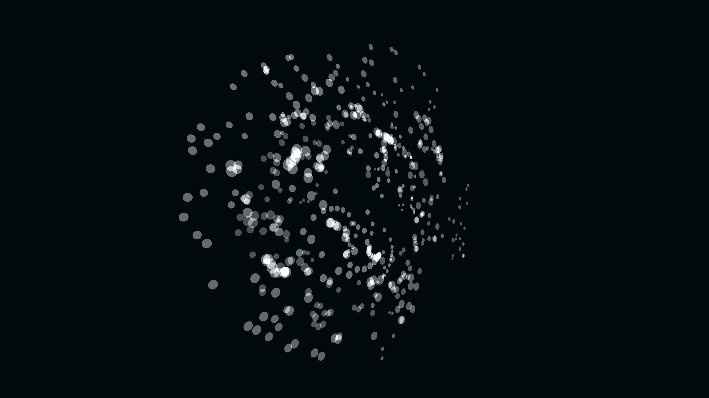

# neon_fluid_torus_knot_organism_3d

A fluid, swirling torus knot that is composed of thousands of overlapping translucent spheres, undulating and shifting colors like a living neon organism.

## Technique

Points are calculated along a mathematical torus knot (`p=2, q=3`). Their positions are then distorted by 3D OpenSimplex noise to create a living, undulating effect. Translucent glowing spheres are drawn at these points with additive blending and a rotating hue based on particle index and frame count.
