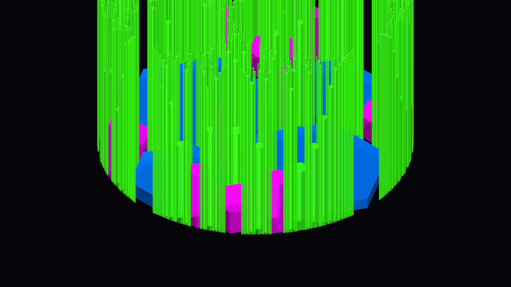

# neon_gasket

## Metadata
- **Date**: 2026-05-03
- **Theme**: fractal urbanism, cyberpunk, geometry, infinite detail
- **Technique**: Apollonian Gasket (Descartes' Circle Theorem), isometric projection, curvature-based height mapping, neon hexagonal prisms

## Concept
A dense, fractal metropolis reimagined from the Apollonian Gasket; 800 glowing hexagonal buildings in electric blue, laser pink, and cyber lime are projected isometrically, with tiny needle-like towers pulsing at extreme heights around massive central hubs.

## Technical Details
- **Renderer**: P2D
- **Simulation**: Apollonian Gasket (Descartes' Circle Theorem)
- **Visuals**: isometric projection, curvature-based height mapping, neon hexagonal prisms
- **Animation**: 10s @ 60fps (typical)
