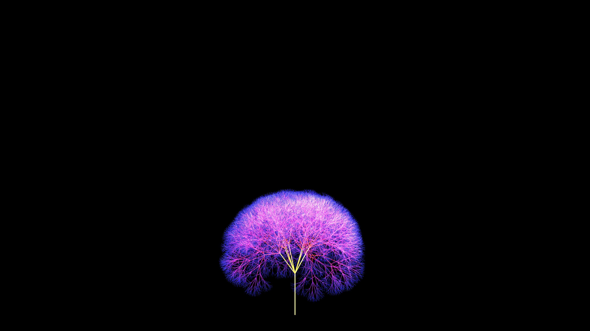

# neon_geometric_recursive_fractal_tree_3d

## Metadata
- **Date**: 2026-06-17
- **Theme**: A 3D animation of a complex geometric L-system tree growing and branching out symmetrically, with le
- **Technique**: Uses recursion (`push_matrix()`, `translate()`, `rotate()`, `pop_matrix()`) to generate a 3D branching structure up to a depth of 8. The branching angles are driven by slow sine waves, making the neon fractal tree continuously sway and bloom over time while the camera revolves around it.
- **Logic Lab Reference**: 

## Concept
A 3D animation of a complex geometric L-system tree growing and branching out symmetrically, with leaves/nodes pulsating with light.

## Technical Details
- **Renderer**: Unknown
- **Simulation**: Unknown
- **Visuals**: Unknown
- **Animation**: Unknown
