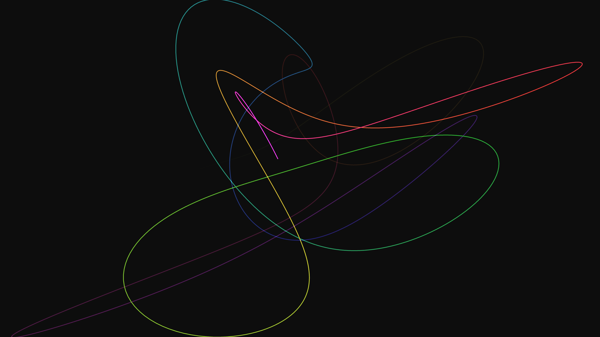

# neon_harmonograph_orbital_paths_3d

## Metadata
- **Date**: 2026-06-13
- **Theme**: A massive, glowing multi-axis harmonograph that continuously draws and erases complex, infinitely lo
- **Technique**: A 3D particle path is mathematically generated using coupled sine waves with shifting frequencies to simulate a harmonograph. It calculates and draws hundreds of glowing line segments each frame with an fading history tail and additive color blending.
- **Logic Lab Reference**: 

## Concept
A massive, glowing multi-axis harmonograph that continuously draws and erases complex, infinitely looping spirograph patterns in 3D space.

## Technical Details
- **Renderer**: Unknown
- **Simulation**: Unknown
- **Visuals**: Unknown
- **Animation**: Animation (20s @ 60fps)
