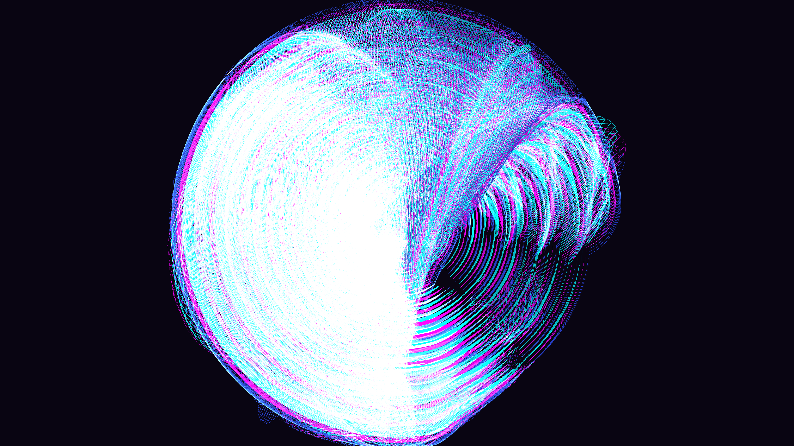

# neon_memory_corruption_rings

## Metadata
- **Date**: 2026-05-25
- **Theme**: - **Date**: 2026-05-25 - **Theme**: Corrupted memory addresses reading as shifting topological rings
- **Technique**: Unknown
- **Logic Lab Reference**: 

## Concept
- **Date**: 2026-05-25
- **Theme**: Corrupted memory addresses reading as shifting topological rings in a cybernetic dream.
- **Technique**: Parametric 3D rings that distort with high-frequency 1D Perlin noise and chromatic aberration. Rendered in P3D with additive blending and motion blur.
- **Description**: Spinning, glitching rings of neon light breaking apart in a dark void.

## Technical Details
- **Renderer**: P3D
- **Simulation**: Unknown
- **Visuals**: Unknown
- **Animation**: Unknown
