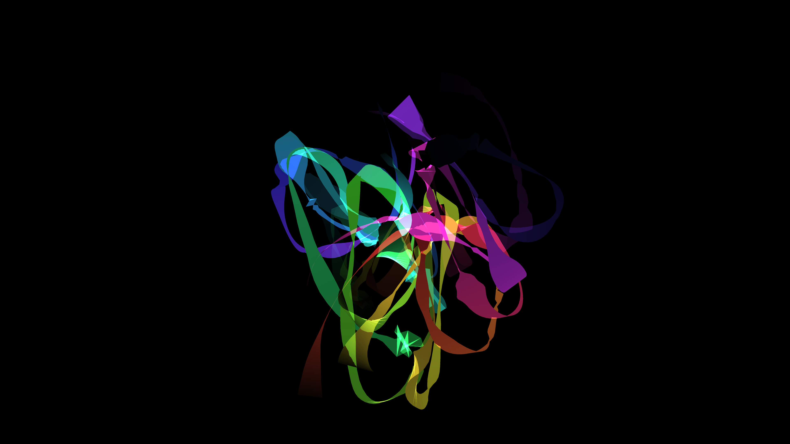

# neon_ribbon_sweep_dance_3d

## Metadata
- **Date**: 2026-06-11
- **Theme**: **Date**: 2026-06-11 **Theme**: Elegant, glowing neon ribbons performing a complex, synchronized dan
- **Technique**: Unknown
- **Logic Lab Reference**: 

## Concept
**Date**: 2026-06-11
**Theme**: Elegant, glowing neon ribbons performing a complex, synchronized dance in 3D space, twisting and folding over themselves.
**Technique**: Multiple parametric 3D curves where a `QUAD_STRIP` ribbon is extruded along the path. The paths are driven by layered sine waves and 3D Perlin noise.

An animated 15s sequence of glowing neon ribbons performing a synchronized 3D dance.

## Technical Details
- **Renderer**: Unknown
- **Simulation**: Unknown
- **Visuals**: Unknown
- **Animation**: Unknown
