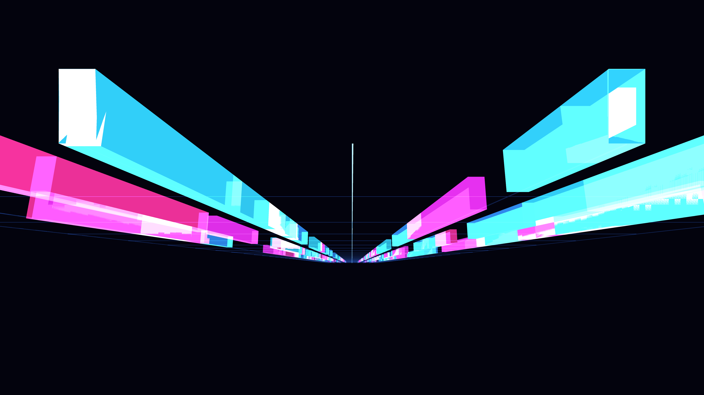

# neon_superhighway_data_trails_3d

A futuristic glowing neon superhighway stretching into infinity, with fast-moving data packets leaving bright light trails.

## Technique

A perspective grid acts as a highway. Hundreds of data packets, represented by 3D boxes, move rapidly along the Z-axis. As they approach the camera, their alpha increases, creating a fade-in effect from the distance. Additive blending and bright cyan/magenta hues create a classic synthwave/cyberpunk aesthetic.
