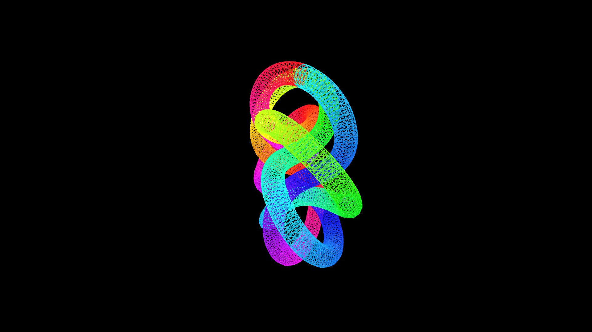

# neon_wireframe_torus_knot

## Metadata
- **Date**: 2026-05-23
- **Theme**: A mesmerizing 3D mathematical structure sweeping out a glowing neon tube along a (3,7) Torus Knot
- **Technique**: Unknown
- **Logic Lab Reference**: 

## Concept
A mesmerizing 3D mathematical structure sweeping out a glowing neon tube along a (3,7) Torus Knot.

- **Date**: 2026-05-23
- **Theme**: Topology, geometry, wireframe 3D rendering, glowing aesthetics.
- **Technique**: Evaluates the parametric equations for a (3,7) Torus Knot to generate a complex, interlocking continuous curve in 3D space. To render it with volume instead of just a thin line, we calculate the Frenet-Serret frame (tangent, normal, binormal vectors) at every point along the curve. We then extrude a 12-sided circle along these axes, using `py5.begin_shape(py5.TRIANGLE_STRIP)` to draw a hollow, wireframe 3D tube. The entire structure smoothly rotates on all three axes while rainbows of neon colors race rapidly along its length. 15s 60fps MP4.
- **Description**: A highly complex, mathematically perfect 3D knot floats in the center of a black void. Instead of a solid surface, the knot is drawn as an intricate wireframe mesh composed of thousands of glowing neon lines. As the knot rotates smoothly, bright pulses of pink, blue, and green light race around its infinite loops, creating a deeply satisfying, hypnotic visual loop.

## Technical Details
- **Renderer**: Unknown
- **Simulation**: Unknown
- **Visuals**: Unknown
- **Animation**: Contains animation details
