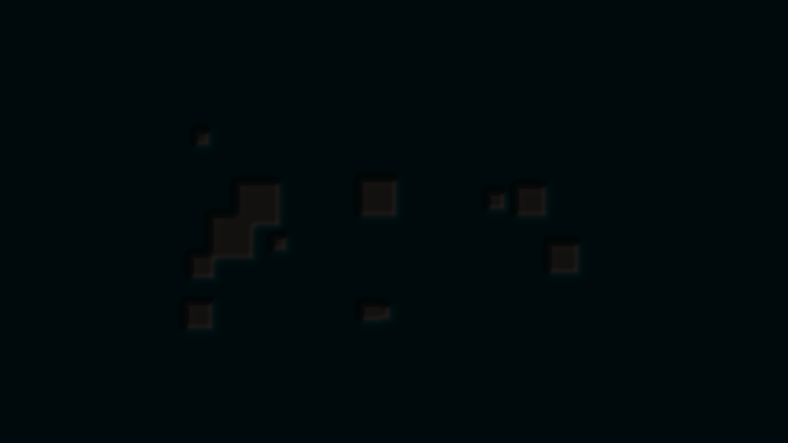

# neural_coral

## Metadata
- **Date**: 2026-05-04
- **Theme**: Biological growth, neural pathways, iridescent calcification.
- **Technique**: Gray-Scott Reaction-Diffusion, 3D gradient shading, optimized vectorized simulation, atmospheric bloom.
- **Logic Lab Reference**: None

## Concept
A dense, organic maze of coral-like ridges that pulse with light; 3D-like shading and bioluminescent highlights create a sense of deep-sea biological intelligence and intricate natural architecture.

## Technical Details
- **Renderer**: P2D
- **Simulation**: reaction-diffusion.
- **Visuals**: bloom-like highlights.
- **Animation**: 10 seconds at 30fps
