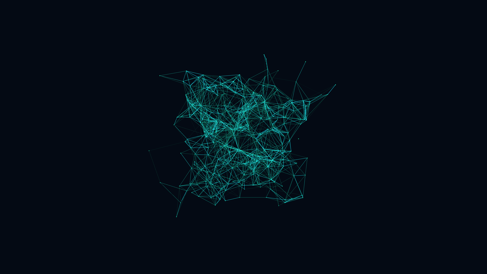

# neural_plexus_synaptic_web_3d

## Metadata
- **Date**: 2026-05-31
- **Theme**: Generative Art
- **Technique**: Generating 300 nodes drifting in 3D space. Their coordinates are governed by a continuous 3D OpenSimplex noise field traversing a circle in time, guaranteeing a seamless 10-second loop. A highly optimized, vectorized Numpy array dynamically calculates all 90,000 pairwise distances per frame. When nodes float within a specific proximity threshold, glowing geometric lines are drawn between them, with opacity fading out based on the inverse distance squared.
- **Logic Lab Reference**: 

## Concept
No concept description provided.

## Technical Details
- **Renderer**: Unknown
- **Simulation**: Unknown
- **Visuals**: Unknown
- **Animation**: Contains animation details
