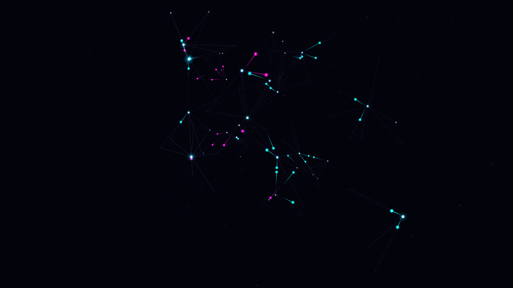

# neural_synapse

## Metadata
- **Date**: 2026-05-03
- **Theme**: biology, networks, intelligence, electricity.
- **Technique**: Stochastic graph-based signal propagation, 3D perspective projection, branching activation cascades, additive bloom trails.
- **Logic Lab Reference**: None

## Concept
A complex, glowing web of bioluminescent nodes firing electric magenta and cyan signals; pulses cascade through a rotating 3D network, creating a shimmering, interconnected mind against a deep indigo void.

## Technical Details
- **Renderer**: P2D
- **Simulation**: Stochastic graph-based signal propagation, 3D perspective projection, branching activation cascades, additive bloom trails.
- **Visuals**: additive blending, persistent trails, bloom-like highlights.
- **Animation**: 5 seconds at 60fps
