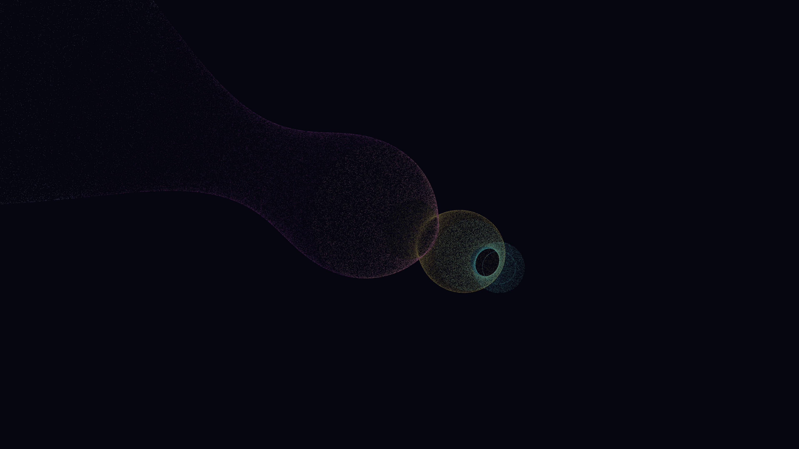

# neutrino_flavor_oscillation

## Metadata
- **Date**: 2026-05-07
- **Theme**: Neutrinos, flavor oscillation, weak interaction, ghostly flux, beautiful night sky.
- **Technique**: 3D high-velocity particle simulation (220,000 particles) using vectorized NumPy. Particles follow needle-sharp trajectories representing ultra-high energy fluxes. Each particle's "flavor state" is modeled as a harmonic oscillator that modulates its HSB color (Cyan/Amethyst/Gold) and opacity to create a "ghostly" shifting effect. Features multi-pass additive rendering and a high-density starfield (12,000 stars). 60fps high-bitrate MP4.
- **Logic Lab Reference**: None

## Concept
A majestic vision of subatomic ghosts; a dense, shimmering stream of spectral light erupts from a stellar core, its particles flickering and shifting between electric cyan, royal amethyst, and gold as they surge through the star-dusted obsidian void.

## Technical Details
- **Renderer**: P3D
- **Simulation**: Vectorized NumPy, NumPy, particle.
- **Visuals**: additive blending, HSB spectral mapping, bloom-like highlights, prismatic color, dark-field contrast.
- **Animation**: 15 seconds at 60fps
