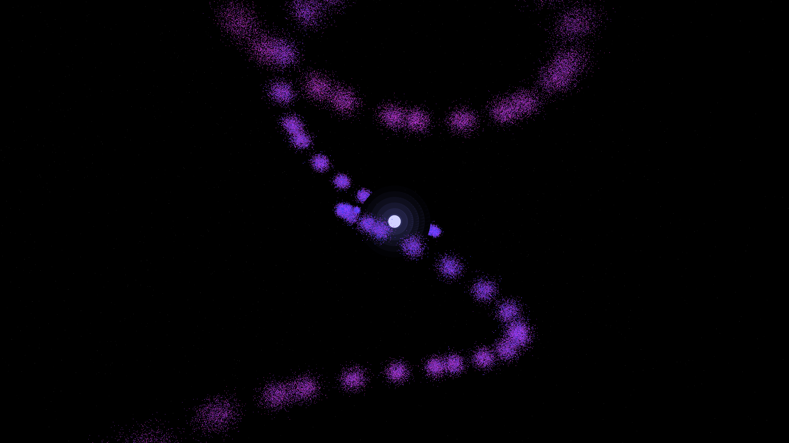

# neutron_star_jet

## Metadata
- **Date**: 2026-05-06
- **Theme**: Neutron star, relativistic jets, pulsar, magnetic precession, beautiful night sky.
- **Technique**: High-velocity particle emission (160,000 particles) from two antipodal poles of a central precessing sphere. Particles follow relativistic trajectories with helical twisting (magnetic field) and outward expansion. The rotation axis precesses over time, creating a "lighthouse" sweep effect. Multi-pass rendering for the blindingly bright core and the shimmering spectral jets. 60fps high-bitrate MP4 encoding.
- **Logic Lab Reference**: None

## Concept
A terrifyingly powerful cosmic lighthouse; two blindingly bright beams of cobalt and magenta energy erupt from a shimmering white core, sweeping through the star-dusted void in a complex precessing rhythm that illuminates the deep celestial void.

## Technical Details
- **Renderer**: P3D
- **Simulation**: particle.
- **Visuals**: HSB spectral mapping, bloom-like highlights, prismatic color, dark-field contrast.
- **Animation**: 10 seconds at 60fps
