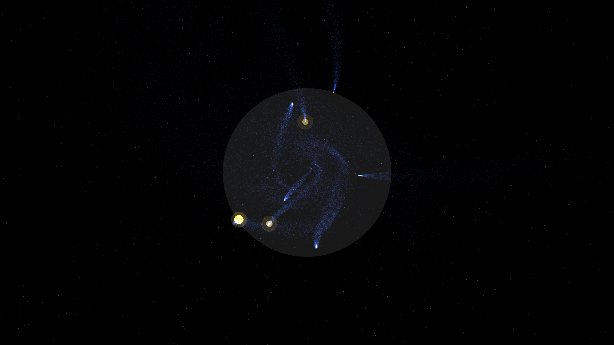

# neutron_star_starquake

## Metadata
- **Date**: 2026-05-08
- **Theme**: Neutron stars, starquakes, crustal fracture, magnetospheric flaring, beautiful night sky.
- **Technique**: 3D simulation of a neutron star surface using a noise-deformed sphere. Implements "Starquake" events where the crust fractures along stress-driven boundaries, rendered as high-intensity additive lines with volumetric glow. Ejected plasma (150,000 particles) is advected along helical magnetic field lines using vectorized NumPy. Features multi-pass additive rendering with an "Electric Cobalt/Gold" HSB palette and a high-density background starfield (12,000 stars). 60fps high-bitrate MP4.
- **Logic Lab Reference**: None

## Concept
A majestic, somber vision of a neutron star's violent surface; the dark obsidian crust shudders and splits, revealing blinding white-gold energy through jagged cracks that erupt into shimmering indigo plasma filaments against the star-dusted deep indigo void.

## Technical Details
- **Renderer**: P3D
- **Simulation**: Vectorized NumPy, NumPy, particle.
- **Visuals**: additive blending, HSB spectral mapping, bloom-like highlights.
- **Animation**: 15 seconds at 60fps
