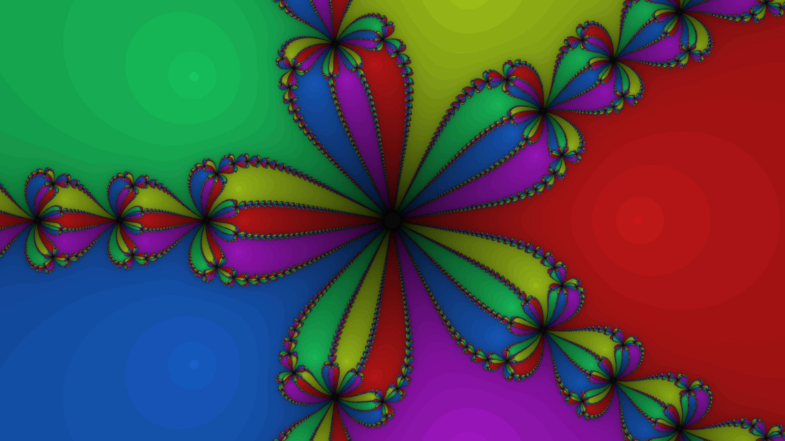

# Newton Fractal

Newton-Raphson iteration applied to z⁵ − 1 on the complex plane partitions every pixel into one of five basins of convergence; each basin is colored by which root (at the five fifth-roots of unity) the iteration reaches. Convergence speed maps to brightness, making slow-converging boundary pixels dark and revealing the fractal Julia-set lace that separates the five vivid regions.
