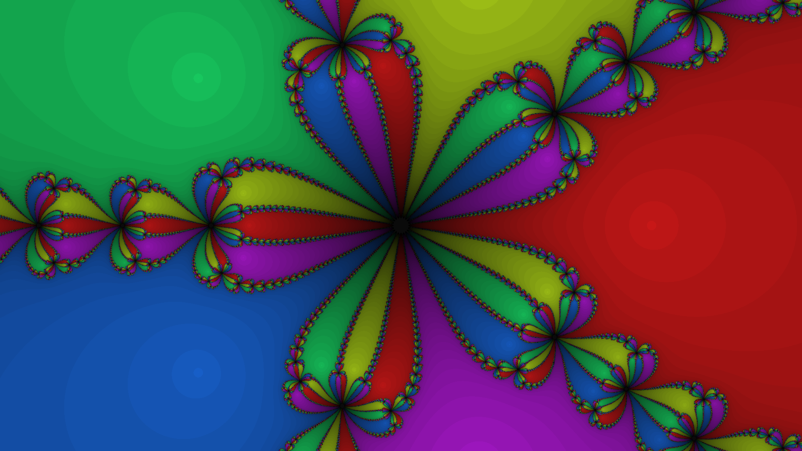

# newton_fractal

## Metadata
- **Date**: 2026-04-25
- **Theme**: mathematics, complex dynamics, numerical analysis.
- **Technique**: Newton-Raphson iteration on z⁵−1, basin-of-convergence coloring, convergence-speed brightness mapping.
- **Logic Lab Reference**: None

## Concept
Five colored basins separate the complex plane into regions converging to each fifth-root of unity; the fractal Julia-set boundary between basins traces dark lace of infinite detail.

## Technical Details
- **Renderer**: P2D
- **Simulation**: Newton-Raphson iteration on z⁵−1, basin-of-convergence coloring, convergence-speed brightness mapping.
- **Visuals**: bloom-like highlights, dark-field contrast.
- **Animation**: Still image
