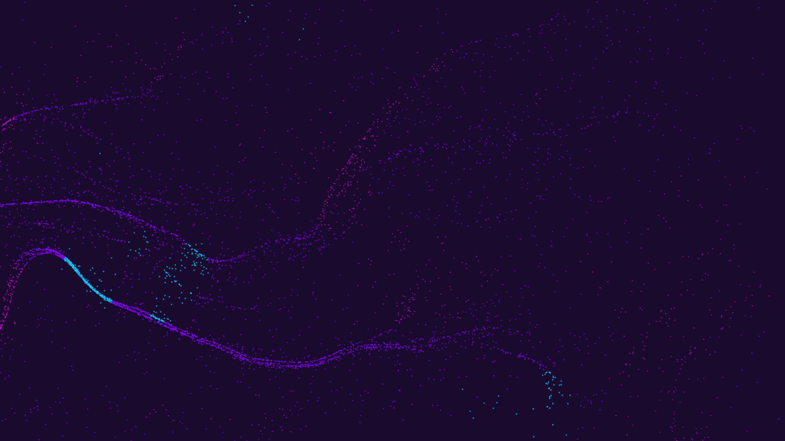

# noise_field_flow

## Metadata
- **Date**: 2026-05-17
- **Theme**: A mesmerizing visualization of particles flowing along invisible currents defined by turbulent Perli
- **Technique**: Unknown
- **Logic Lab Reference**: 

## Concept
A mesmerizing visualization of particles flowing along invisible currents defined by turbulent Perlin noise, demonstrating emergent fluid-like behavior from simple particle dynamics.

## Technical Details
- **Renderer**: Unknown
- **Simulation**: Unknown
- **Visuals**: Unknown
- **Animation**: Contains animation details
