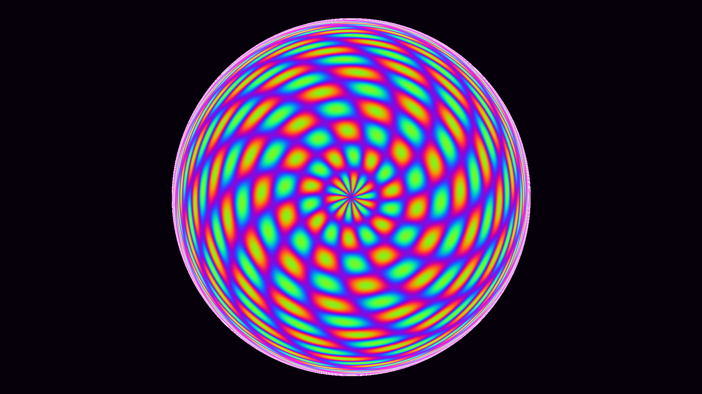

# non_euclidean_poincare_disk

## Metadata
- **Date**: 2026-05-23
- **Theme**: Hyperbolic geometry visualized via the Poincaré disk model
- **Technique**: Unknown
- **Logic Lab Reference**: 

## Concept
Hyperbolic geometry visualized via the Poincaré disk model. A continuous zooming/flowing pattern that tessellates the disk with organic, glowing shapes, creating the illusion of infinite depth at the boundary.

- **Date**: 2026-05-23
- **Theme**: Non-Euclidean geometry, hyperbolic space, Poincaré disk model, infinite recursion.
- **Technique**: Procedural pixel-shader simulation. Maps the pixel canvas to the complex plane, restricts it to the unit disk, and applies time-varying Möbius transformations to simulate translation/zooming in hyperbolic space. The transformed hyperbolic distance drives a trigonometric tessellation pattern, colored with a shimmering Cyan-Emerald-Violet palette. 15s 60fps MP4.
- **Description**: A glowing circular window into a non-Euclidean universe. As the view translates endlessly forward, intricate, shimmering geometric forms flow out from the impossibly deep boundary, expanding gracefully as they approach the center before folding away, visualizing the mind-bending infinite space contained within a finite disk.

## Technical Details
- **Renderer**: Unknown
- **Simulation**: Unknown
- **Visuals**: Unknown
- **Animation**: Contains animation details
