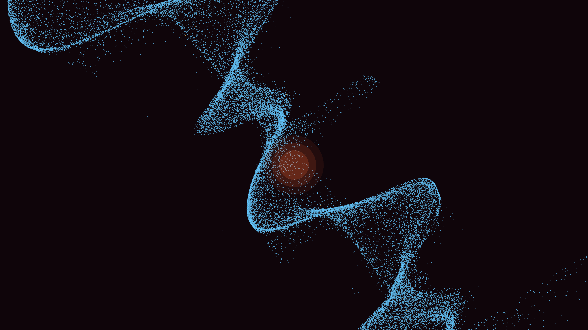

# nucleosynthesis_fusion_core

## Metadata
- **Date**: 2026-05-07
- **Theme**: Stellar nucleosynthesis, nuclear fusion, plasma convection, gamma-ray bursts, beautiful night sky.
- **Technique**: 3D high-velocity particle simulation (150,000 points) using vectorized `py5.points()`. Implements a softened central gravity and a toroidal convection field. Particles undergo "elemental transformation" (H -> He -> C -> O) based on local temperature/density proxies. Triggers "gamma-ray" streaks upon fusion events. Multi-pass additive rendering for the central plasma glow. 60fps high-bitrate MP4.
- **Logic Lab Reference**: None

## Concept
A churning, incandescent heart of a giant star; a dense sea of electric blue nuclei collide and ignite in spectacular bursts of gold and violet light, slowly transforming the core into a rich, multi-layered tapestry of heavier elements.

## Technical Details
- **Renderer**: P3D
- **Simulation**: particle.
- **Visuals**: additive blending, bloom-like highlights, dark-field contrast.
- **Animation**: 10 seconds at 60fps
