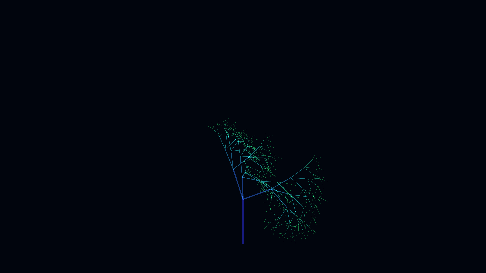

# optical_fiber_fractal_tree_3d

## Metadata
- **Date**: 2026-06-07
- **Theme**: An intricate, 3D fractal-like tree structure made of glowing optical fibers that grows and branches 
- **Technique**: Recursive branching in 3D space (`py5.translate`, `py5.rotate_x`, `py5.rotate_z`). Additive blending (`py5.blend_mode(py5.ADD)`) combined with partial transparency to simulate the glowing optical fiber look. A 4D Perlin noise field determines the branch sway (wind), adding a dynamic, organic feel to the mathematical structure.
- **Logic Lab Reference**: 

## Concept
An intricate, 3D fractal-like tree structure made of glowing optical fibers that grows and branches recursively, swaying gently in an invisible wind.

## Technical Details
- **Renderer**: Unknown
- **Simulation**: Unknown
- **Visuals**: Unknown
- **Animation**: Unknown
