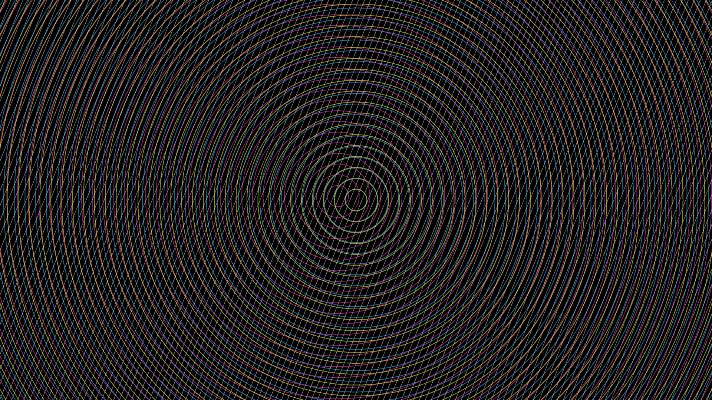

# optical_illusion_moire_patterns

A mind-bending optical illusion. Dense geometric grids of cyan, magenta, and yellow overlap against a dark background. As the layers slowly drift and rotate out of alignment, impossible new shapes—pulsating stars, shimmering ripples, and swirling vortexes—suddenly appear and dissolve within the negative space. The interference patterns create a dizzying, hypnotic visual effect that seems to vibrate and move in ways that the actual drawn lines do not, challenging the limits of human perception.
