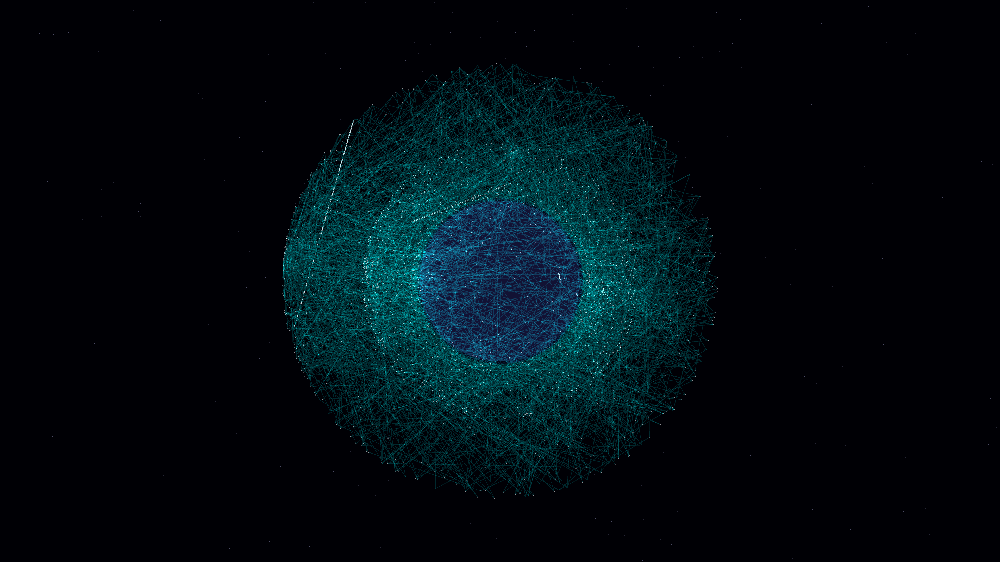

# orbital_data_mesh

- **Date**: 2026-05-06
- **Theme**: Orbital infrastructure, global connectivity, high-tech urbanism, beautiful night sky
- **Technique**: 3D orbital simulation of 3,000 satellites across three distinct shells. Proximity-based laser links form a dynamic "data mesh" using additive line rendering. Features a dark, atmospheric planetary core with multi-layer volumetric glow and a high-density background starfield. Randomized "data bursts" flare through the network to simulate active information transfer. 60fps high-bitrate MP4.
- **Description**: A majestic, high-tech vision of a planet cocooned in a shimmering web of global connectivity; thousands of satellites and laser links in cyber cyan and stark white pulse with information against the silent, star-dusted void of a deep indigo night.

