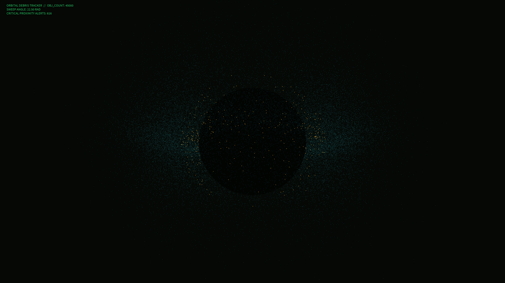

# orbital_debris_cloud_tracker

## Metadata
- **Date**: 2026-05-26
- **Theme**: A procedural radar scope tracking tens of thousands of space debris fragments orbiting in a massive 
- **Technique**: Uses `py5.points()` with numpy vectorization to handle 45,000 points in real-time, grouped into orbital shells based on Keplerian distribution. Points are colored based on proximity and velocity to simulate critical alerts.
- **Logic Lab Reference**: 

## Concept
A procedural radar scope tracking tens of thousands of space debris fragments orbiting in a massive 3D cloud.

## Technical Details
- **Renderer**: Unknown
- **Simulation**: Unknown
- **Visuals**: Unknown
- **Animation**: Contains animation details
