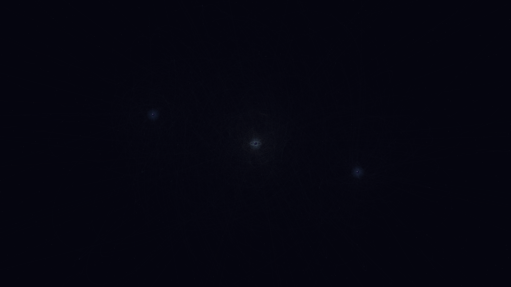

# orbital_mechanics

## Metadata
- **Date**: 2026-05-02
- **Theme**: astronomy, gravity, orbits, cosmic dance.
- **Technique**: RK4 N-body simulation, velocity-based line thickness, long-exposure trail accumulation.
- **Logic Lab Reference**: None

## Concept
A complex, glowing map of hundreds of satellite orbits in gold and seafoam dancing around a multi-planet system with subtle rings and atmospheric halos.

## Technical Details
- **Renderer**: P2D
- **Simulation**: RK4 N-body simulation, velocity-based line thickness, long-exposure trail accumulation.
- **Visuals**: persistent trails, dark-field contrast.
- **Animation**: Animation
