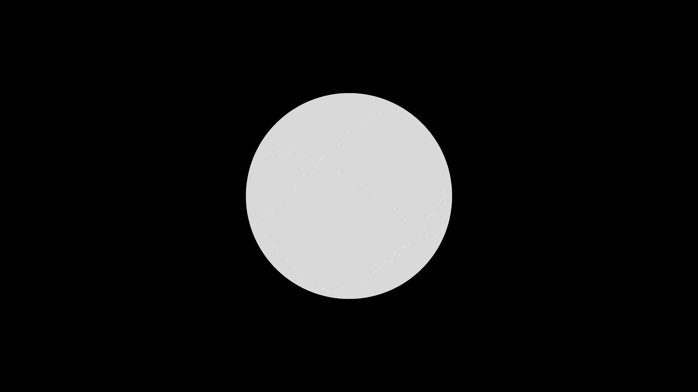

# parametric_silk_weaver_3d

## Metadata
- **Date**: 2026-05-27
- **Theme**: - **Date**: 2026-05-27 - **Theme**: A luminescent mechanical loom continuously weaving and unwinding
- **Technique**: Unknown
- **Logic Lab Reference**: 

## Concept
- **Date**: 2026-05-27
- **Theme**: A luminescent mechanical loom continuously weaving and unwinding delicate threads of neon silk in three-dimensional space.
- **Technique**: A complex parametric equation (combining multiple rotating 3D Lissajous curves) generates continuous, smooth coordinates. A rolling buffer of 30,000 points is connected by semi-transparent bezier curves or lines, shifting colors based on spatial depth to simulate woven fiber optics.
- **Description**: A spinning 3D geometric shape resembling a luminous woven basket or flower that continuously morphs and folds into itself.

## Technical Details
- **Renderer**: Unknown
- **Simulation**: Unknown
- **Visuals**: Unknown
- **Animation**: Unknown
