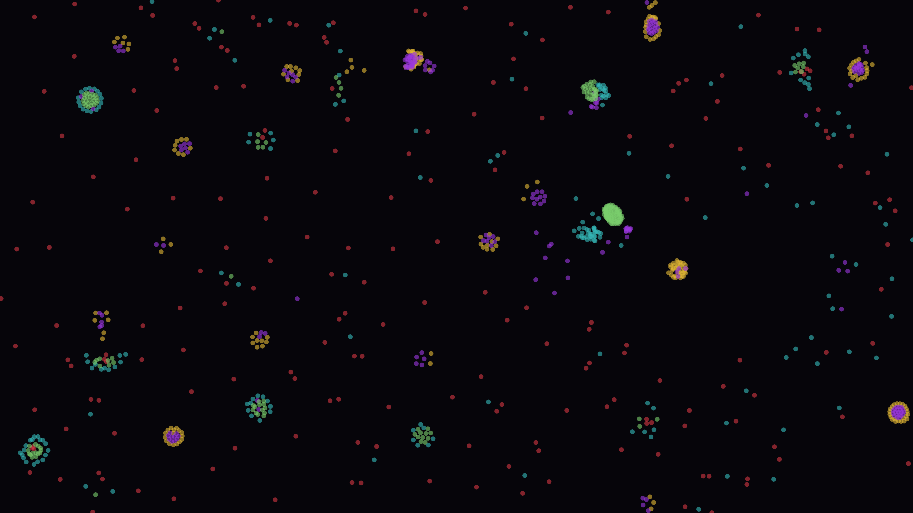

# particle_life

## Metadata
- **Date**: 2026-04-26
- **Theme**: emergence, artificial life, self-organization, complex systems.
- **Technique**: N×N pairwise force matrix (random signed attraction/repulsion), quadratic force profile in interaction ring, toroidal boundaries, numpy vectorized Euler integration.
- **Logic Lab Reference**: None

## Concept
1000 particles of 5 types governed by a random force matrix self-organize into clusters, cell-like membranes, and predator-prey structures; every run produces a unique emergent ecology from the same simple physics.

## Technical Details
- **Renderer**: P2D
- **Simulation**: NumPy.
- **Visuals**: bloom-like highlights, dark-field contrast.
- **Animation**: Still image
