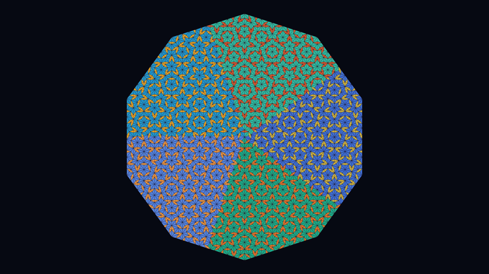

# penrose_tiling

## Metadata
- **Date**: 2026-04-26
- **Theme**: mathematics, aperiodic tiling, quasicrystals, 5-fold symmetry.
- **Technique**: Robinson triangle substitution (golden-ratio split), 7 iterations from decagonal seed, 5-sector angular coloring.
- **Logic Lab Reference**: None

## Concept
~6100 half-rhombus triangles from 7 rounds of Penrose P3 substitution; fat rhombuses colored in 5 warm shades and thin rhombuses in 5 cool shades by angular sector, forming a never-repeating mosaic with perfect 10-fold symmetry.

## Technical Details
- **Renderer**: P2D
- **Simulation**: Robinson triangle substitution (golden-ratio split), 7 iterations from decagonal seed, 5-sector angular coloring.
- **Visuals**: bloom-like highlights, dark-field contrast.
- **Animation**: Still image
