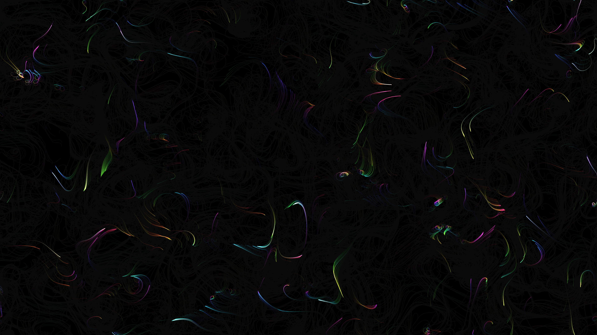

# perlin_flow_ribbons_2d

## Metadata
- **Date**: 2026-05-27
- **Theme**: - **Date**: 2026-05-27 - **Theme**: A mesmerizing flow field of vibrant ribbons that swirl and tangl
- **Technique**: Unknown
- **Logic Lab Reference**: 

## Concept
- **Date**: 2026-05-27
- **Theme**: A mesmerizing flow field of vibrant ribbons that swirl and tangle gracefully, guided by multi-scale Perlin noise.
- **Technique**: A system of 4,000 particles is traced over time through a vector field generated by octaves of simplex/Perlin noise. The trails fade slowly with a low-opacity background overlay. The ribbons change color based on the vector field angle.
- **Description**: An abstract flow field using 2D Perlin noise and ribbons.

## Technical Details
- **Renderer**: Unknown
- **Simulation**: Unknown
- **Visuals**: Unknown
- **Animation**: Unknown
