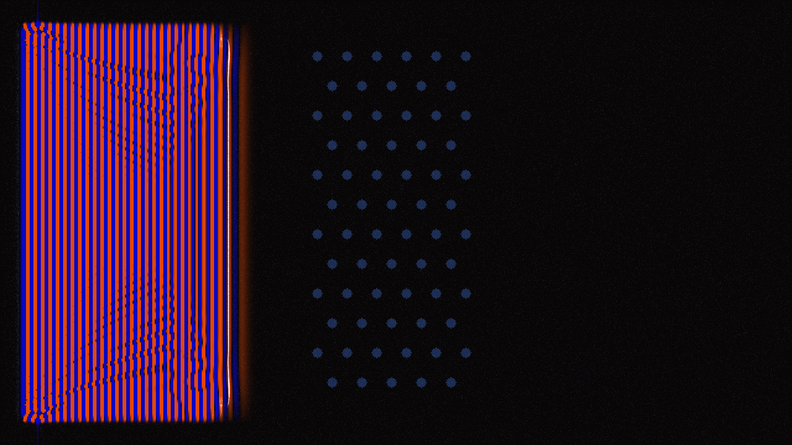

# phononic_crystal_lens

## Metadata
- **Date**: 2026-05-22
- **Theme**: A 2D Finite-Difference Time-Domain (FDTD) simulation of a scalar wave passing through a phononic cry
- **Technique**: Unknown
- **Logic Lab Reference**: 

## Concept
A 2D Finite-Difference Time-Domain (FDTD) simulation of a scalar wave passing through a phononic crystal metamaterial slab. 

A continuous sinusoidal line source generates waves that propagate through a defined lattice of scatterers. By tuning the scatterer radius and material properties (softer scatterers), the wave visibly threads through the crystal's pass-band and collimates on the far side, demonstrating an acoustic lensing effect. The simulation uses an amber and slate-indigo color palette to visualize wave compression and rarefaction, overlaid with 120,000 active tracer particles that flow along the local pressure gradients.

**Palette:** Amber (compression) | Slate-Indigo (rarefaction) | Steel-Blue (crystal scatterers)

## Technical Details
- **Renderer**: Unknown
- **Simulation**: Unknown
- **Visuals**: Unknown
- **Animation**: Unknown
