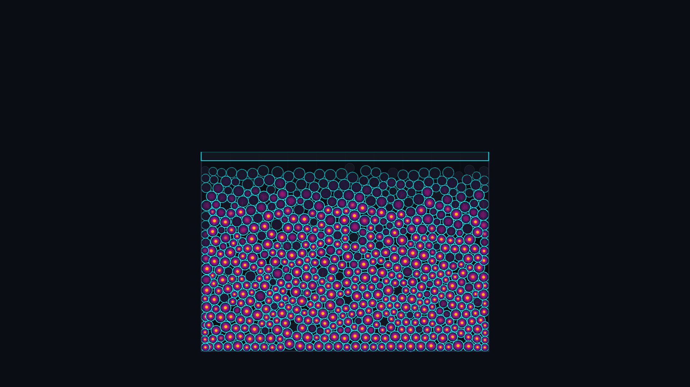

# photoelastic_granular_jamming

## Metadata
- **Date**: 2026-05-17
- **Theme**: Granular physics, photoelastic stress birefringence, contact force chains, jamming transitions
- **Technique**: 2D soft-sphere Discrete Element Method (DEM) using spring-dashpot contact dynamics solved in a multi-step vectorized NumPy physics engine, integrated with a multi-layered polariscope photoelastic rendering model
- **Logic Lab Reference**: `physics/granular/dem_contact.py`

## Concept
*photoelastic_granular_jamming* explores the structural beauty of disordered crowds under pressure. It simulates 650 polydisperse granular disks (glass-like beads of varying sizes) piled in a container. When compressed by a descending upper piston, these beads slide, rotate, and lock into place, undergoing a classic jamming transition where they transition from a loose, fluid-like state to a rigid, solid-like state.

The artwork draws its visual inspiration from polariscope photoelasticity, a technique where stress inside transparent plastics or gelatin is visualized as colorful fringes under polarized light. 

The color palette is meticulously constructed to emphasize physical energy:
- Grains are rendered as *Smoky Translucent Obsidian* (#121620) glass disks that nestle under gravity.
- When squeezed, they light up from within with vibrant, nested *Deep Purple*, *Neon Pink*, and *Incandescent Gold* fringes, directly proportional to the local compressive stress tensor on each grain.
- Running *inside* these translucent beads is a roaring network of contact force chains—drawn as glowing neon lines connecting the centers of grains in contact. Low-load filaments are thin amethyst threads, while primary backbone chains glow as blinding solar gold and hot orange lightning bolts carrying the load down to the floor of the cell.

As the compression increases, the force chains dynamically buckle, snap, and collapse in energetic, sudden rearrangements—capturing the tactile, dramatic reconfigurations of granular packs.

## Technical Details
- **Renderer**: P2D (OpenGL)
- **Simulation**: Vectorized soft-sphere DEM in NumPy with 8 integration substeps per frame for numerical rigidity. Contact overlaps are computed via broadcasted pairwise distances, with spring repulsion stiffness $k_n = 12.0$ and dashpot damping $\gamma_n = 2.0$.
- **Visuals**: Layered rendering with force chain filaments underneath, translucent glass shells on top, nested stress-fringe circles, and a neon-ruled compressing piston.
- **Animation**: 15 seconds at 60 frames per second (900 total frames), compiled into high-fidelity 4K MP4.
