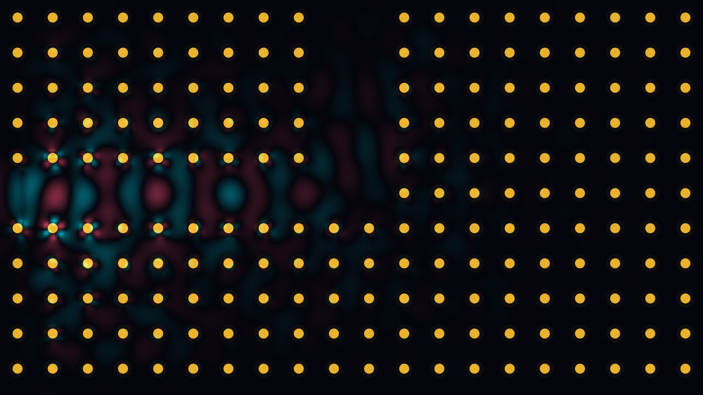

# photonic_bandgap_waveguide

## Metadata
- **Date**: 2026-05-17
- **Theme**: - **Theme**: Light guided through a labyrinth of silent obsidian pillars, trapped within a designed 
- **Technique**: Unknown
- **Logic Lab Reference**: 

## Concept
- **Theme**: Light guided through a labyrinth of silent obsidian pillars, trapped within a designed defect where it flows around a sharp turn without scattering, visualizing the control of light at the microscopic scale.
- **Technique**: 2D Transverse Magnetic (TM) Finite-Difference Time-Domain (FDTD) electromagnetic field simulation on a square lattice of circular dielectric pillars with an L-shaped defect channel and absorbing sponge boundary layers.
- **Description**: Sinusoidal electric field waves (Teal crests and Coral troughs) propagate smoothly down a horizontal channel, bend perfectly at a 90-degree corner, and flow upward, while adjacent gold pillars scatter the evanescent field, lighting up with local wave intensity.

## Technical Details
- **Renderer**: Unknown
- **Simulation**: Unknown
- **Visuals**: Unknown
- **Animation**: Unknown
