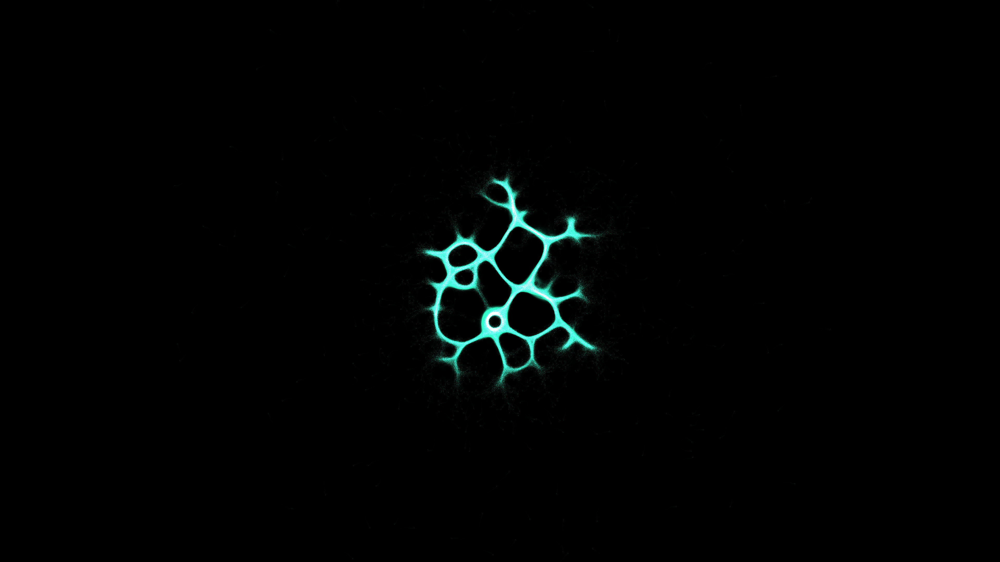

# physarum_slime_mold_network_2d

## Metadata
- **Date**: 2026-06-11
- **Theme**: **Date**: 2026-06-11 **Theme**: A glowing bioluminescent network that slowly grows, explores, and op
- **Technique**: Unknown
- **Logic Lab Reference**: 

## Concept
**Date**: 2026-06-11
**Theme**: A glowing bioluminescent network that slowly grows, explores, and optimizes its paths to find resources, resembling a living alien organism.
**Technique**: 2D particle simulation of Physarum polycephalum where agents deposit and follow chemical trails with diffusion and decay.

An animated 15s sequence of an organically growing and optimizing network.

## Technical Details
- **Renderer**: Unknown
- **Simulation**: Unknown
- **Visuals**: Unknown
- **Animation**: Unknown
