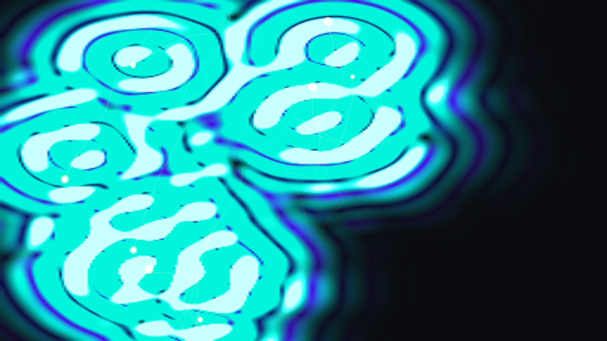

# pilot_wave_hydrodynamics

## Metadata
- **Date**: 2026-05-17
- **Theme**: An autonomous, physics-driven generative media art piece visualizing the chaotic, self-guided dynami
- **Technique**: Unknown
- **Logic Lab Reference**: 

## Concept
An autonomous, physics-driven generative media art piece visualizing the chaotic, self-guided dynamics of Faraday wave walking droplets (hydrodynamic pilot-wave memory).

## Technical Details
- **Renderer**: Unknown
- **Simulation**: Unknown
- **Visuals**: Unknown
- **Animation**: Contains animation details
