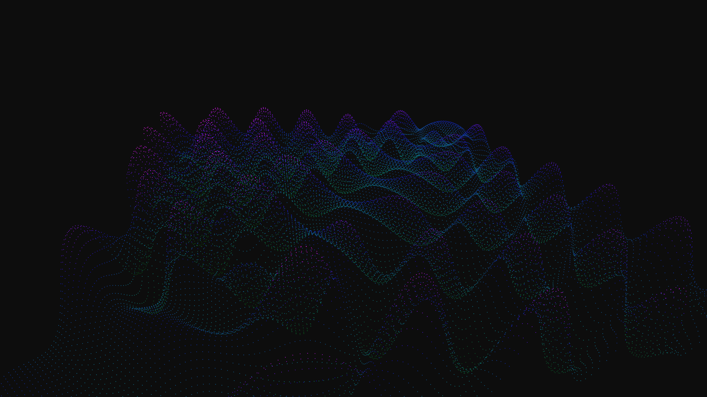

# plasma_fluid_interference_patterns_3d

## Metadata
- **Date**: 2026-06-05
- **Theme**: Generative Art
- **Technique**: A dense grid of 3D `py5.POINTS`. The Z-height and color of each point are calculated by summing multiple high-frequency sine and cosine waves offset by time and distance from multiple moving "droplet" origins, creating dynamic interference patterns.  
- **Logic Lab Reference**: 

## Concept
No concept description provided.

## Technical Details
- **Renderer**: Unknown
- **Simulation**: Unknown
- **Visuals**: Unknown
- **Animation**: Contains animation details
