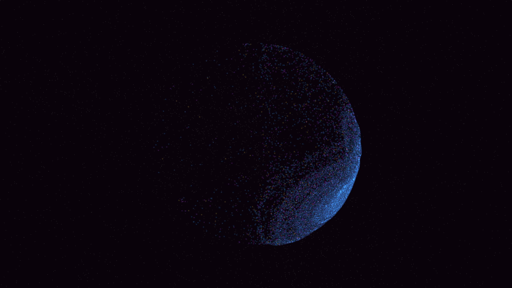

# primordial_polarization_swirl

## Metadata
- **Date**: 2026-05-09
- **Theme**: B-mode polarization, primordial gravitational waves, CMB, beautiful night sky.
- **Technique**: 3D simulation of 120,000 particles on a spherical shell advected by a multi-scale "curl" vector field representing tensor perturbations. Features multi-pass additive rendering with HSB spectral mapping and cosmic expansion scaling. 60fps high-bitrate MP4.
- **Logic Lab Reference**: None

## Concept
A majestic visualization of the early universe's first light; silken swirls of celestial azure and soft gold energy are twisted into intricate B-mode patterns by primordial gravitational waves, shimmering across a deep amethyst void.

## Technical Details
- **Renderer**: P3D
- **Simulation**: particle.
- **Visuals**: additive blending, HSB spectral mapping, bloom-like highlights, prismatic color, dark-field contrast.
- **Animation**: 12 seconds at 60fps
