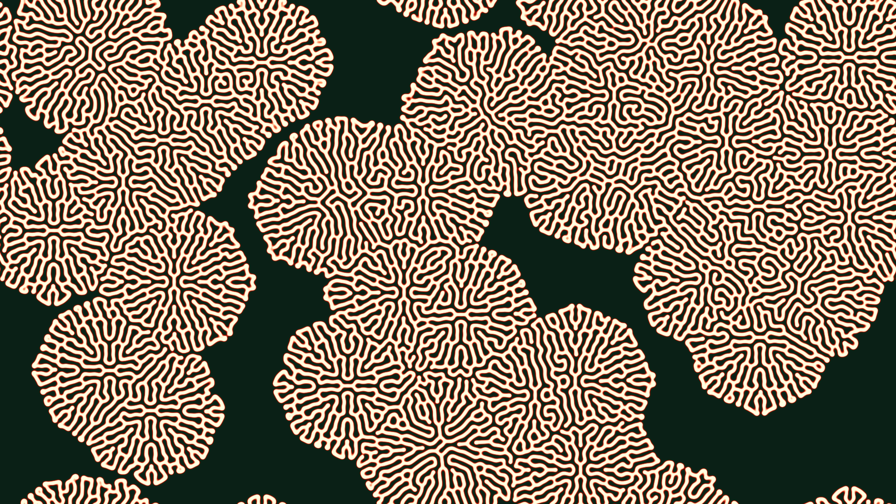

# primordial_reaction_diffusion

A macroscopic view of an alien brain coral bleaching and blooming, as labyrinthine biochemical reactions spread rapidly across a membrane.

## Details

- **Date**: 2026-05-30
- **Theme**: A macroscopic view of an alien brain coral bleaching and blooming, as labyrinthine biochemical reactions spread rapidly across a membrane.
- **Technique**: Gray-Scott Reaction-Diffusion simulated using NumPy vectorized Laplacian operator. Calculations run at 1080p and are rapidly upscaled to 4K to render thick organic membranes.
- **Palette**: Deep emerald green, intricate coral pinks, bone white, dark crimson.

## Previews



## Usage

```bash
uv run python main.py
```
