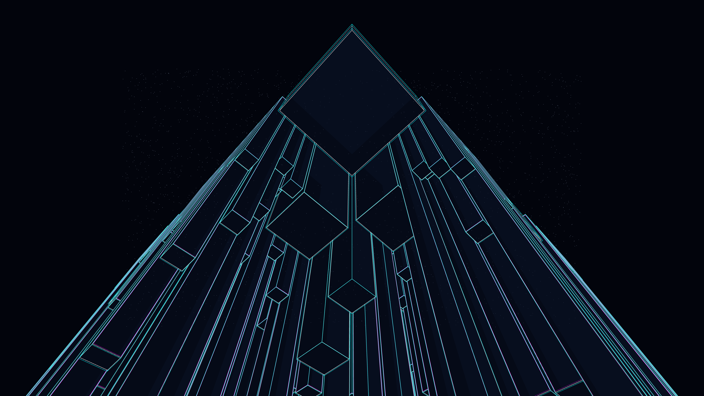

# prismatic_architecture

## Metadata
- **Date**: 2026-05-03
- **Theme**: architecture, crystals, iridescence, geometry, modularity
- **Technique**: recursive isometric cube subdivision, thin-film interference color mapping, additive SCREEN blending, stochastic growth

## Concept
A futuristic metropolis of shimmering crystalline structures; iridescent teal, rose, and gold faces refract light across a recursive geometric landscape, creating intense luminosity where structures converge against an obsidian sky.

## Technical Details
- **Renderer**: P2D
- **Simulation**: recursive isometric cube subdivision
- **Visuals**: thin-film interference color mapping, additive SCREEN blending, stochastic growth
