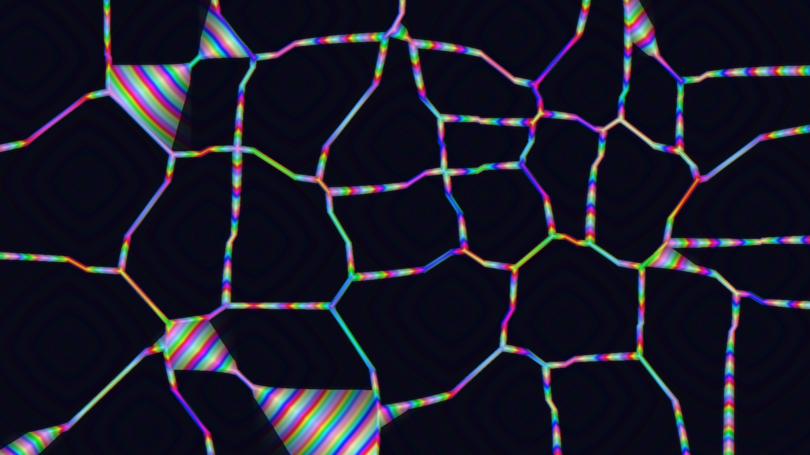

# prismatic_cellularity

## Metadata
- **Date**: 2026-05-04
- **Theme**: Urban metabolism, cellular logic, spectral pressure, modern architectural twist
- **Technique**: Multi-scale Worley noise (L1/L2 hybrid), derivative-based edge detection, HSB spectral mapping, atmospheric haze rendering, optimized NumPy grid-partitioning
- **Logic Lab Reference**: `mathematical/worley_noise/worley_noise.py`

## Concept
A dense, glowing "cellular metropolis" of blocky, rhythmic structures that pulse and shift against a deep indigo night sky; sharp iridescent edges and soft glowing cores create a sense of operational intelligence and high-tech urban flow.

## Technical Details
- **Renderer**: P2D
- **Simulation**: Multi-scale Worley noise (L1/L2 hybrid)
- **Visuals**: derivative-based edge detection, HSB spectral mapping, atmospheric haze rendering, optimized NumPy grid-partitioning
