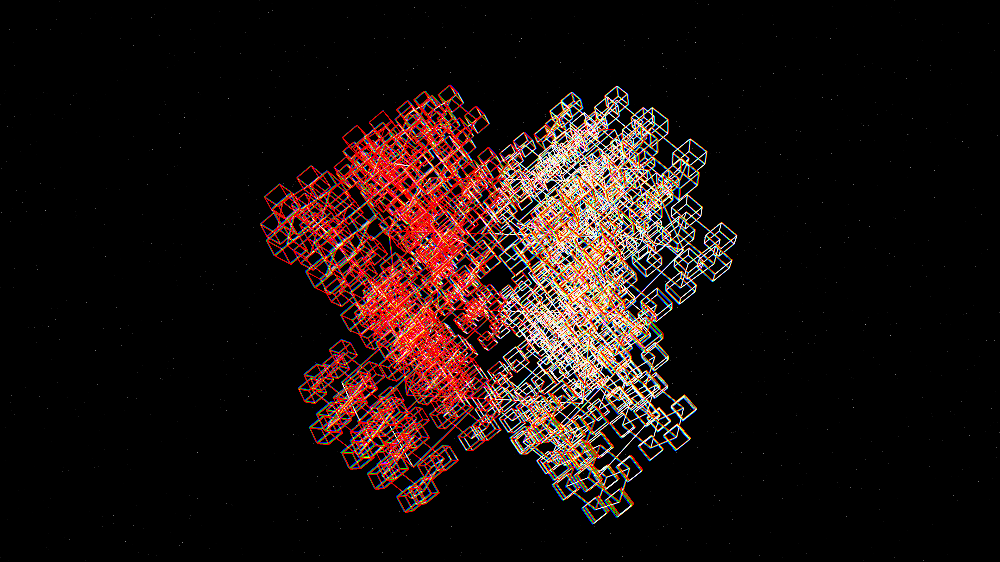

# prismatic_recursive_glass

## Metadata
- **Date**: 2026-05-10
- **Theme**: Optical physics, high-tech urbanism, chromatic dispersion on a massive recursive glass structure.
- **Technique**: 3D recursive structure (fractal depth 4) rendered with a translucent shader-like effect in Py5. Using P3D, massive transparent monolithic slabs rotate and unfold dynamically. Chromatic aberration is faked by drawing the structure three times (R, G, B) with slight rotational offsets and additive blending.
- **Logic Lab Reference**: None

## Concept
A towering, intricate fractal crystal floats in the void. As it unfolds, its edges split the light into brilliant holographic rainbows, creating an awe-inspiring sense of scale and digital purity against a star-dusted night.

## Technical Details
- **Renderer**: P3D
- **Simulation**: recursive.
- **Visuals**: additive blending, prismatic color, dark-field contrast.
- **Animation**: 10 seconds at 60fps
