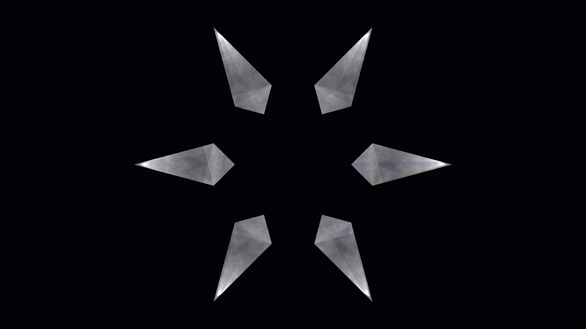

# prismatic_reflection

## Metadata
- **Date**: 2026-05-03
- **Theme**: optics, geometry, physics, spectral dispersion.
- **Technique**: recursive ray-casting, 15-channel spectral decomposition, additive blending, star-polygon mirror maze.
- **Logic Lab Reference**: None

## Concept
A complex web of light fractured into its constituent rainbow colors through 20 levels of reflection within a geometric star-shaped mirror maze; high-brilliance spectral fringes against a deep navy void.

## Technical Details
- **Renderer**: P2D
- **Simulation**: recursive.
- **Visuals**: additive blending, HSB spectral mapping, prismatic color, dark-field contrast.
- **Animation**: Animation
