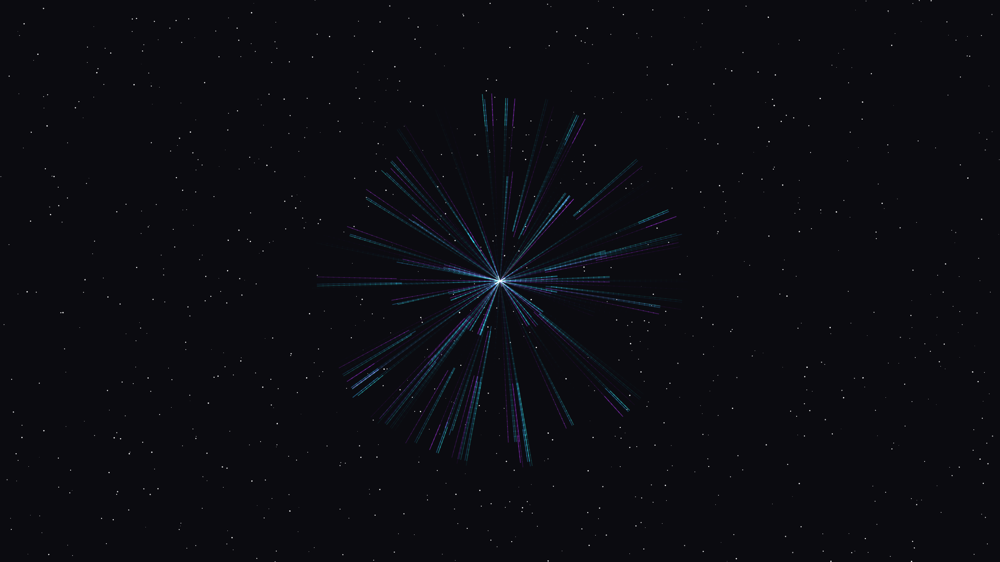

# prismatic_resonator

## Metadata
- **Date**: 2026-05-05
- **Theme**: Optical physics, spectral refraction, geometric resonance, beautiful night sky
- **Technique**: Recursive ray-tracing (P2D), chromatic dispersion simulation, high-persistence path accumulation, additive bloom rendering

## Concept
An intricate visualization of optical resonance where shimmering spectral rays in electric cyan, cobalt, and amethyst bounce and refract inside a circular resonator; the build-up of silken, thread-like patterns pulses with a geometric harmony against a star-dusted midnight void.

## Technical Details
- **Renderer**: P2D
- **Simulation**: Recursive ray-tracing (P2D)
- **Visuals**: chromatic dispersion simulation, high-persistence path accumulation, additive bloom rendering
- **Animation**: 10s @ 60fps (typical)
