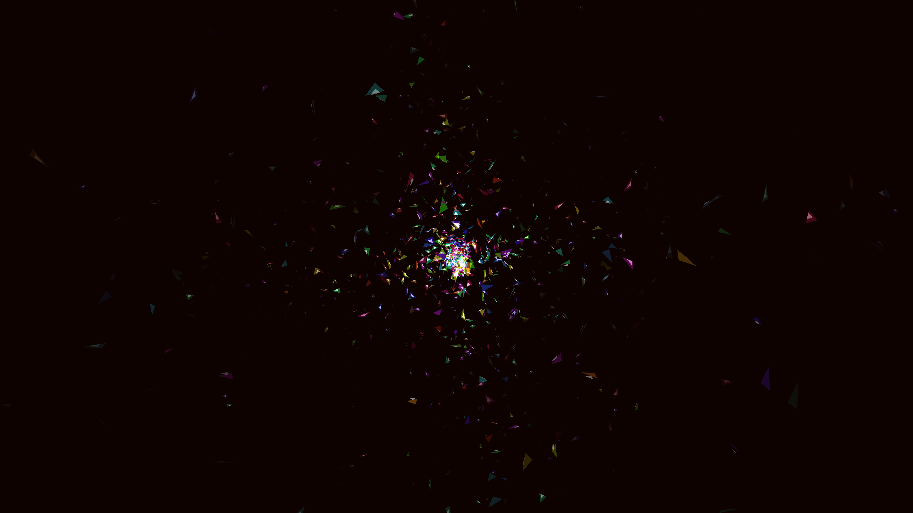

# prismatic_spectral_glass_shatter_3d

## Details
- **Date**: 2026-06-07
- **Theme**: Thousands of shattered glass shards imploding and exploding in a mesmerizing 3D pattern, refracting bright prismatic colors.
- **Technique**: 3D particles with rotational dynamics and additive blending to simulate glowing glass shards. The shards follow a sine wave animation to continuously explode and implode in a loop.
- **Palette**: Obsidian background, vivid rainbow spectral colors.

## Media

