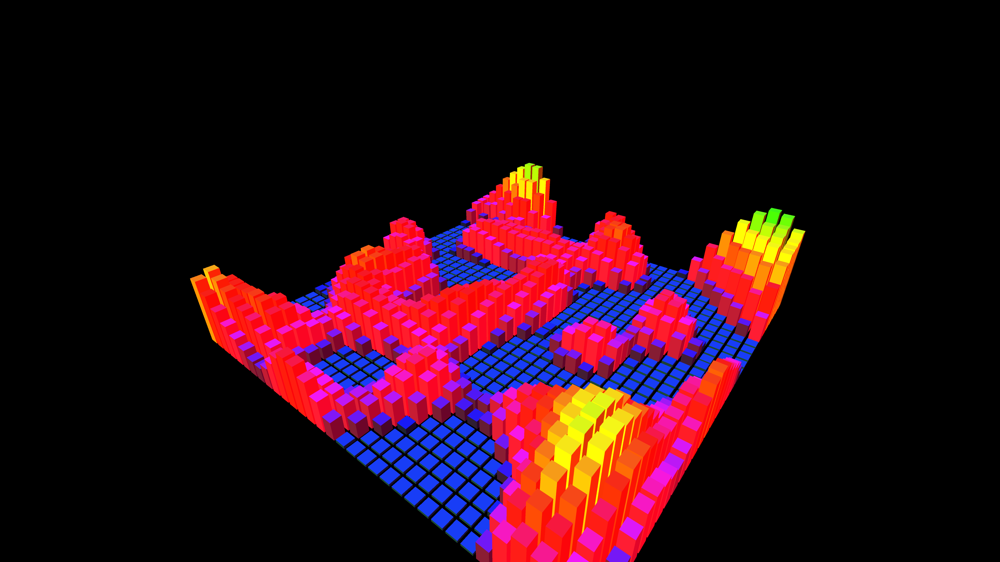

# procedural_voxel_city_pulse

## Metadata
- **Date**: 2026-05-27
- **Theme**: - **Date**: 2026-05-27 - **Theme**: An isometric view over a glowing "voxel city" where blocks smoot
- **Technique**: Unknown
- **Logic Lab Reference**: 

## Concept
- **Date**: 2026-05-27
- **Theme**: An isometric view over a glowing "voxel city" where blocks smoothly rise and fall like a pulsing cityscape.
- **Technique**: A 2D grid of 3D boxes. The height of each box is determined by a combination of a 2D spatial sine wave and Perlin noise. The colors shift based on height and time.
- **Description**: An animated procedural voxel city.

## Technical Details
- **Renderer**: Unknown
- **Simulation**: Unknown
- **Visuals**: Unknown
- **Animation**: Unknown
